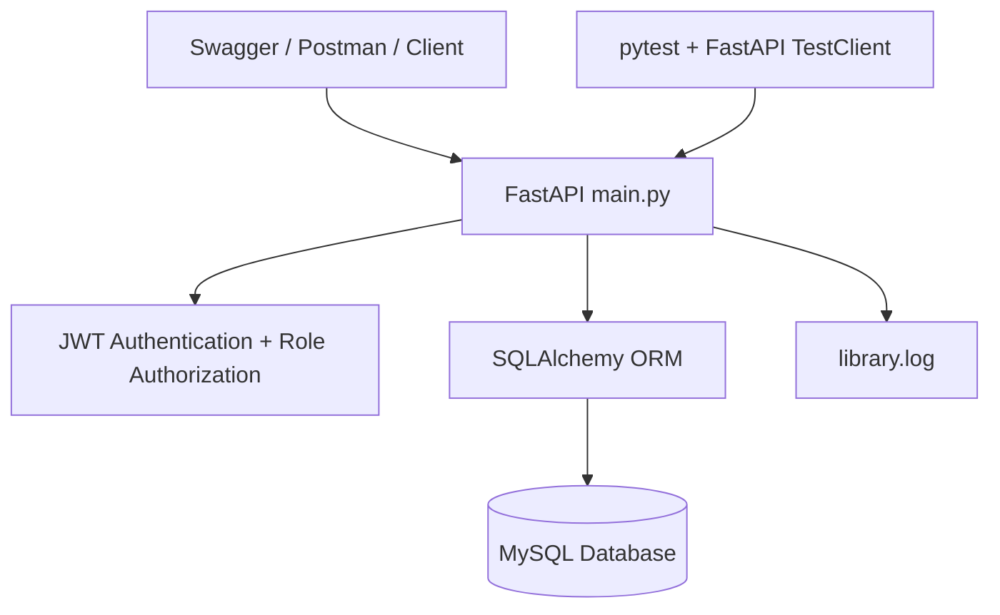

# Architecture Diagram

```mermaid
flowchart TD
    Client[Swagger / Postman / Client]
    API[FastAPI main.py]
    Auth[JWT Authentication + Role Authorization]
    ORM[SQLAlchemy ORM]
    DB[(MySQL Database)]
    Logs[library.log]
    Tests[pytest + FastAPI TestClient]

    Client --> API
    API --> Auth
    API --> ORM
    ORM --> DB
    API --> Logs
    Tests --> API
```
