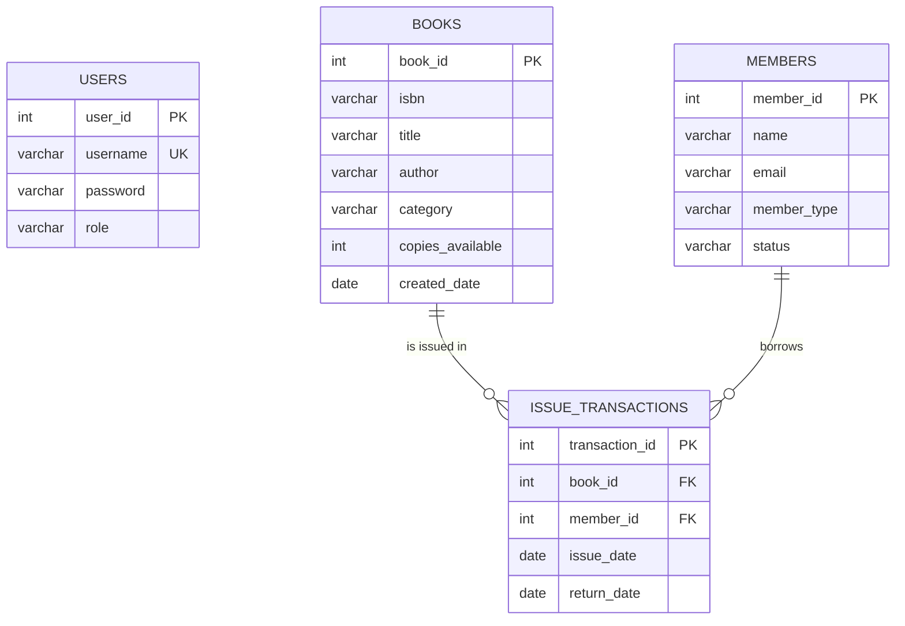

# ER Diagram

Note: the diagram shows the logical relationships expected by the application. If your existing MySQL schema does not declare foreign-key constraints, the relationships are still enforced by the application queries but are not database-level FK constraints.
